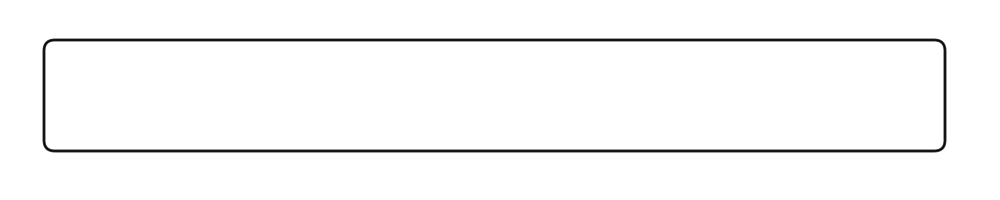
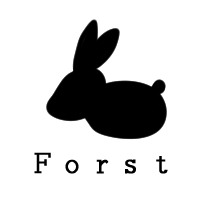

<!doctype html
<html>
<head>
<title>For st.</title>
<meta charset="utf8">
</head>
<body>
  <h1 style="font-size:500%;">Forst</h1>
  

    
  

  

  
  

   
   
   
   
   
   
   
  <h2 style="font-size:250%;">**고등학교 축제 홍보<h2>  
    
일시 : **년 **월 **일  
      대상 : 학생  
      학교 축제의 목표 : 학습과 놀이의 즐거운 만남 . . . .
      

 
 
 

<h3 style="font-size:70%;">학생들을 위한 프로젝트를 진행하는 팀</h3>

</body>
</html>

